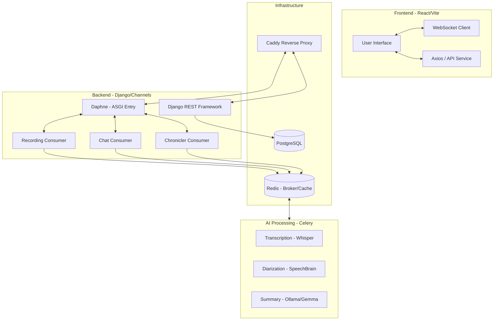

# Architecture

> Auto-generated by /map on 2026-04-10

## Overview

The **Rol Narrator Screen** is a digital assistant for D&D 5e narrators. It provides a real-time interface for character management, chat, and an automated "Cronista" (Chronicler) feature that records session audio, transcribes it using Whisper, identifies speakers via voice embeddings, and generates narrative summaries using a local LLM (Ollama/Gemma).

## Internal & External Components

### Frontend (React + Vite)
- **Purpose:** Provide a responsive, real-time UI for DMs and Players.
- **Location:** `frontend/`
- **Key Patterns:** Context API for global state (`UserContext`), custom hooks for features (`useChat`, `useAudioRecorder`).
- **Styling:** Tailwind CSS with Framer Motion for high-end aesthetics.

### Backend (Django + Channels)
- **Purpose:** Provide REST API and WebSocket hubs.
- **Location:** `rol/` (App logic), `rol_narrator_screen/` (Project config).
- **WebSockets:**
  - `recording_consumer.py`: Handles binary audio streaming.
  - `cronista_consumer.py`: Real-time updates for transcription progress.
  - `chat_consumers.py`: Multi-room chat with whispers.

### Asynchronous Pipeline (Celery)
- **Purpose:** Offload heavy AI tasks (Whisper/SpeechBrain) from the request cycle.
- **Location:** `rol/tasks.py`
- **Workflow:** Recording End → Celery Task → Transcribe → Diarize → Update UI → Generate Summary → Finalize.

## Data Flow

1. **Audio Capture**: Frontend streams raw audio via WebSockets to `recording_consumer.py`, which saves fragments to disk.
2. **Session Finalization**: When the recording stops, a Celery task `process_chronicler_session` is enqueued.
3. **AI Processing**: 
   - **WhisperModel** transcribes audio to text segments.
   - **SpeechBrain Classifier** generates embeddings for each segment.
   - **Speaker Identification** compares segment embeddings against `PerfilDeVoz` store.
4. **Summary Generation**: Transcription fragments are sent to **Ollama** (Gemma 4:e4b) to produce a narrative summary.
5. **Real-time Sync**: Progress is broadcast via `chronicler_updates` WebSocket group to update user dashboards live.

## Integration Points

| Service | Type | Purpose |
|---------|------|---------|
| Ollama | API (HTTP) | Local LLM for summary generation |
| PostgreSQL | DB | Persistent storage for characters, users, and sessions |
| Redis | Broker | Task queue (Celery) and Channel Layer storage |

## Technical Debt

- [ ] **Empty States**: Improve empty states in `CronistForgePage`.
- [ ] **Character Creation**: Implement "Create new character" flow in `CharactersPage`.
- [ ] **Error Handling**: Enhance partial failure handling in the transcription pipeline.
- [ ] **API Filtering**: Implement proper filtering for character and session lists in views.

## Conventions

- **Naming**: Python/Django standards in backend; CamelCase for components, hooks formatted as `useFeature` in frontend.
- **Structure**: Feature-based component structure in `frontend/src/components`.
- **Testing**: `pytest-django` for backend tests.
- **Styles**: Strict use of CSS variables and Tailwind classes for a unified design language.
